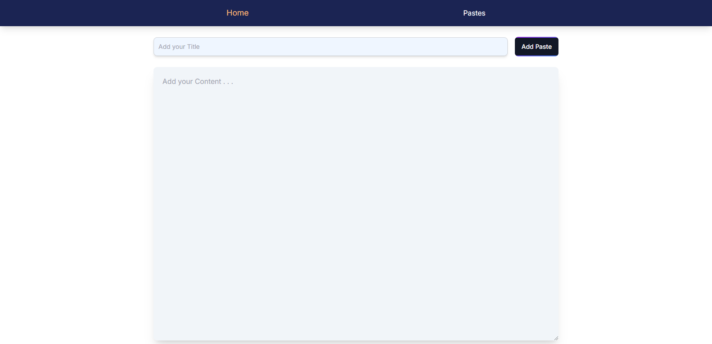
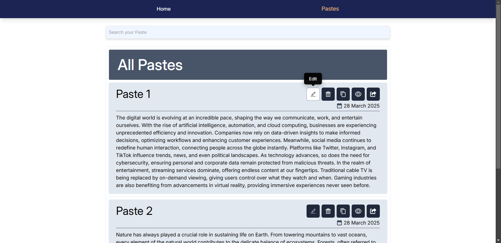
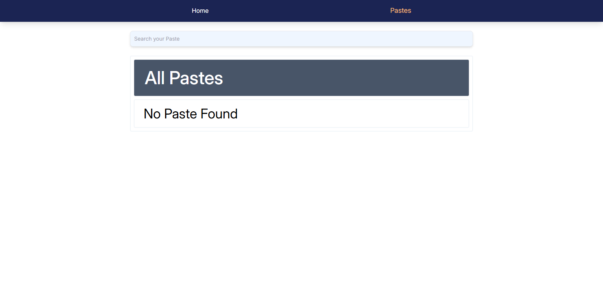
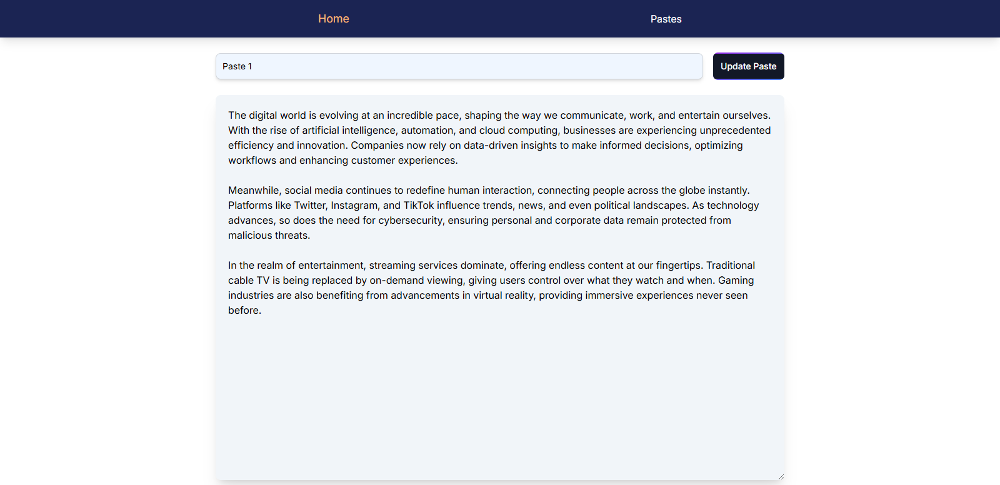

# Paste App

## 🚀 Description

Paste App is a lightweight and user-friendly web application designed for managing and sharing text snippets effortlessly. Whether you need to store quick notes, share code snippets, or save important text for later, Paste App provides a seamless experience with a clean and responsive interface.

## ✨ Features

- 📋 **Easy Snippet Management** - Paste, store, and retrieve text snippets with ease.
- 🔗 **Instant Sharing** - Generate shareable links for your snippets.
- 🎨 **Beautiful UI** - Responsive design powered by Tailwind CSS.
- ⚛️ **Built with React** - Uses React for a dynamic and efficient user experience.
- 💾 **Local Storage Support** - Snippets are stored in the browser's local storage for persistence.
- 🛠 **Developer-Friendly** - Built with modern frontend tools for a smooth experience.

## 🏗 Tech Stack

- **Frontend:** React, JavaScript (ES6+)
- **Storage:** Local Storage
- **Styling:** Tailwind CSS
- **Build Tool:** Vite
- **Linting:** ESLint

## 📂 Project Structure

```
Paste App/
│── node_modules/         # Dependencies
│── public/               # Static assets
│── src/                  # Source code
│   │── app/              # Application logic
│   │── components/       # Reusable React components
│   │── features/         # Application features
│   │── screenshots/      # Screenshots of the application
│   │── index.css         # Global styles
│   │── Layout.js         # Layout component
│   │── main.js           # Application entry point
│── .gitignore            # Git ignore file
│── eslint.config.js      # ESLint configuration
│── index.html            # Main HTML file
│── package.json          # Project metadata and dependencies
│── package-lock.json     # Dependency lock file
│── postcss.config.js     # PostCSS configuration
│── README.md             # Project documentation
│── tailwind.config.js    # Tailwind CSS configuration
│── vite.config.js        # Vite configuration
```

## ⚙️ Functionality

- **Paste and Save Snippets** - Users can paste text into the application and save it for later retrieval.
- **Share Snippets** - Each snippet generates a unique shareable link that can be copied and shared.
- **Retrieve and View Snippets** - Users can access stored snippets by entering their respective links.
- **Edit and Delete Snippets** - Users can update or remove their saved snippets if needed.
- **Persistent Storage** - Snippets are saved in local storage, ensuring data remains available even after page reloads.
- **Responsive Design** - Works across different screen sizes and devices.

## 🖼 Screenshots

Here are some screenshots of the application:

### Home Page


### Paste List


### Empty Paste List


### Edit Paste


## ⚙️ Installation

To set up the project locally, follow these steps:

1. **Clone the repository:**
   ```sh
   git clone https://github.com/thebeliever1812/Paste-Web-App.git
   ```
2. **Navigate to the project directory:**
   ```sh
   cd Paste-Web-App
   ```
3. **Install dependencies:**
   ```sh
   npm install
   ```
4. **Start the development server:**
   ```sh
   npm run dev
   ```

## 🚀 Usage

1. Open the application in your browser after starting the development server.
2. Paste and save text snippets.
3. Generate shareable links for snippets.
4. Manage and retrieve stored snippets easily.
5. Edit or delete snippets when necessary.
6. Snippets remain saved even after refreshing the page due to local storage support.

## 🤝 Contributing

Feel free to fork this repository and submit pull requests to improve the project! 😊
